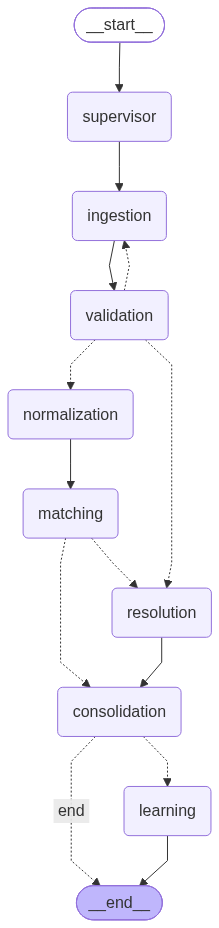

# Agentic Recon -- Architecture

This document describes the system as it actually exists in the codebase today
(through A13 / B14 / C17). It is regenerated/updated alongside the code, not
written once and left to drift -- if you find a mismatch between this doc and
`recon_platform/graph/build.py`, the code is the source of truth; file a fix
here.

## Overview

Three tracks own three layers of one LangGraph pipeline:

- **Data agents (A)** -- ingest raw transactions from CSV/API/SFTP sources,
  validate them, normalize them (FX conversion, entity aliasing, reference
  canonicalization). Lives in `datagents/`.
- **Reasoning agents (B)** -- match book transactions against source
  transactions (deterministic tools first, LLM escalation for hard cases,
  memory-boosted calibration), classify what's left as exceptions, escalate
  high-risk ones to a human, and mine recurring patterns into rule
  suggestions that feed back into matching config. Lives in `reasoning/`.
- **Platform (C)** -- the shared graph shape, state schema, checkpointing/
  resume, HITL review queue, guardrails, observability, eval harness, and
  everything that assembles A + B into one working system. Lives in
  `recon_platform/`.

## Graph shape



Regenerate this diagram directly from the live compiled graph whenever the
node/edge structure changes, so it can never silently drift from the code:

```bash
python scripts_render_graph.py
```

### Nodes

All nodes are real (call actual agent logic) except `supervisor`, which
remains a placeholder -- it logs a message and passes state through. Nothing
in the current scope needs supervisor-level planning/routing beyond the
fixed graph shape below.

| Node | Real since | What it does |
|---|---|---|
| `supervisor` | -- | Placeholder. Logs "Run planned." |
| `ingestion` | A11 | Real ingestion from `book_source_configs`/`bank_source_configs` via `ingest_sources_with_metrics`. Book and bank are ingested via two separate calls and kept separate in state (`Transaction` has no field recording which named source it came from). Increments `retry_count` unconditionally -- see Gates below for why. Stays a pure pass-through (except the `retry_count` bump) when no configs are supplied, so synthetic test states that inject `book_transactions`/`issues` directly still work. |
| `validation` | A11 | Real validation (`validate_transactions`) over the combined transaction set. Concatenates its issues onto whatever `ingestion` already put there -- `issues` has no LangGraph reducer, so returning it verbatim would silently replace ingestion's issues instead of adding to them. |
| `normalization` | A11 | Real normalization (FX conversion, entity aliasing) via `normalize_transactions`, run separately for book and bank so `matching`'s `book_transactions`/`source_transactions` stay populated. Uses a module-level `AliasStore` so the alias cache (A9) persists across nodes and runs. |
| `matching` | B11 | Real matching + exception classification via `run_match_subgraph` (B10): deterministic tools first, optional LLM escalation, memory-guarded calibration, exception classification on the leftovers. Also a pure pass-through when no `book_transactions`/`source_transactions` are present, for the same synthetic-test-state reason as `ingestion`. |
| `resolution` | B11 | Real exception escalation via `escalate_exceptions` (B9): high-risk exceptions go to the shared review queue, low-risk ones auto-resolve. |
| `consolidation` | C11/C14 | Builds a real `ReconReport` from `matched_count`/`unmatched_count`/`exceptions`. `close_ready` is computed from the *live* review queue (`pending_for_run`), not just whether exceptions were classified -- an auto-resolved exception never blocks close, an escalated-but-unresolved one does, even across a resumed HITL run. |
| `learning` | B12/C12 | Mines this run's `match_results`/`exceptions` into `RuleSuggestion`s (B12), persisted to the shared `RuleStore`. Only reachable when `close_ready` is true, so exception-pattern mining never actually fires today -- a known, documented gap (see Known gaps below). |

### Gates

Three conditional edges decide routing; all are pure functions in
`recon_platform/graph/routing.py`, independently unit-testable without
running the graph:

- **`validation_gate`** (after `validation`): no critical issue ->
  `normalization`. A critical issue (severity `error` **and** `row_ref is
  None` -- a batch-level failure like "source unreachable", not a single bad
  row) retries `ingestion` up to `MAX_VALIDATION_RETRIES` times, then
  escalates to `resolution`. A row-level error (a malformed CSV row, a
  rejected validation finding -- `row_ref` set) never blocks the run; that's
  expected noise in any real dataset, already excluded by the tool that
  found it.
- **`matched_gate`** (after `matching`): any unmatched transactions ->
  `resolution`; fully matched -> `consolidation`.
- **`close_ready_gate`** (after `consolidation`): `close_ready` -> `learning`;
  otherwise -> `end`.

### Idempotency and resume

`recon_platform/graph/checkpointer.py`'s `run_pipeline(period,
source_signature, checkpointer)` is the production entrypoint:

- `run_id` is a deterministic hash of `(period, source_signature)` --
  reprocessing the same period against the same source data always maps to
  the same thread, never creates a duplicate run.
- A completed run (`close_ready` true, no pending graph steps) is skipped
  entirely on a second call.
- An **interrupted** run (killed mid-flight, pending steps remain) resumes
  from its last checkpoint via `graph.invoke(None, config=...)` -- continuing
  a paused thread, not restarting it. Passing a fresh state object here
  instead of `None` silently restarts the whole run from `START` and
  double-processes every already-completed node; this was a real bug found
  and fixed while building C16's chaos suite (`tests/test_chaos.py`).

## State schema

`recon_platform/state.py`'s `ReconState` is the single source of truth for
every key any node reads or writes. This matters more than it sounds like it
should: LangGraph builds one channel per declared schema field and **silently
drops any key a node returns that isn't declared here** -- not a theoretical
risk, it happened twice in this repo (`book_source_configs`/
`bank_source_configs` went undeclared for a while, meaning the real
configs-driven ingestion path never actually ran through a real
`graph.invoke()` even though every test passed, because no test exercised
that exact path end-to-end).

| Field | Owner | Purpose |
|---|---|---|
| `run_id`, `period` | C | Identity of this run. |
| `messages` | C | Append-only log (`Annotated` with a reducer -- the one field that *does* accumulate automatically). |
| `issues` | A/C | Validation/ingestion problems. No reducer -- nodes must concatenate manually. |
| `matched_count`, `unmatched_count`, `close_ready`, `retry_count` | B/C | Run-level counters and gate state. |
| `source_configs`, `book_source_configs`, `bank_source_configs` | A | What to ingest. |
| `transactions`, `validation_findings`, `normalized_transactions` | A | Ingestion/validation/normalization output. |
| `book_transactions`, `source_transactions`, `match_results`, `unmatched_book`, `unmatched_source`, `exceptions` | B | Matching/exception output. |
| `ingestion_metrics` | A | Per-source `ToolSpan` metrics (rows in/out, retries, duration). |
| `report` | C | The final `ReconReport`. |
| `rule_suggestions` | B/C | This run's mined `RuleSuggestion`s. |

## Eval methodology

- **Golden datasets**: `sample_data/book.csv` + `sample_data/bank_source.csv`
  are the primary fixture -- hand-labeled, known expected matches/exceptions,
  used across B10-B14, C11, C13, C16 tests. `demo_book.csv`/`demo_bank.csv`
  back the standalone demo app.
- **Metrics** (`recon_platform/eval/metrics.py`): `accuracy`,
  `precision_recall` (C9); `hallucination_rate` -- fraction of matches
  referencing a transaction id outside the real candidate set, should always
  be `0.0` for the deterministic path (C15); `idempotency_check` -- wraps
  `run_pipeline`'s skip-if-complete guarantee into a pass/fail check (C15).
- **Baseline reports** (`recon_platform/eval/baseline.py`, C13): runs the
  real graph E2E with a `GraphTracer` attached, captures auto-match rate,
  exception count, latency, and token cost from the real `ReconReport`,
  writes a versioned JSON+MD report (reusing C9's `write_report`).
- **CI regression gate** (`tests/test_regression_gate.py`, C15): hard
  thresholds (accuracy >= 0.9, hallucination 0.0, idempotent, latency
  budget) against golden data. This test file *is* the gate -- CI
  (`.github/workflows/ci.yml`) runs the full suite (`datagents/`,
  `reasoning/`, `tests/`) on every push/PR, so a regression here fails CI
  directly.
- **Security scan** (`tests/test_c17_security.py`, C17): red-team tests
  proving a prompt-injection payload in a transaction field never reaches an
  LLM (asserts `gateway.usage.calls == 0`, not just that the output looks
  fine), plus a permanent hardcoded-secret scan.

## Known gaps (honest, not aspirational)

- **`learning` never mines exception patterns in practice.** It's only
  reachable when `close_ready` is true, which currently means "zero
  exceptions this run" -- so by the time `learning` runs, `exceptions` is
  always empty. Fixing this needs `close_ready` to mean "exceptions
  resolved" more granularly than it does today, or `learning` to run at a
  different point in the graph.
- **A11-A13 exist only on `intern-b`/`intern-c`, not `intern-a`.** Intern A
  pushed that work directly to `intern-b` rather than `intern-a`; anyone
  checking out `intern-a` alone won't see it.
- **`score_risk`'s weights (B8) were never tuned against real eval
  feedback.** There's no historical outcome data yet in a fresh repo to
  learn from; adjusting the numbers without that would be guessing.
