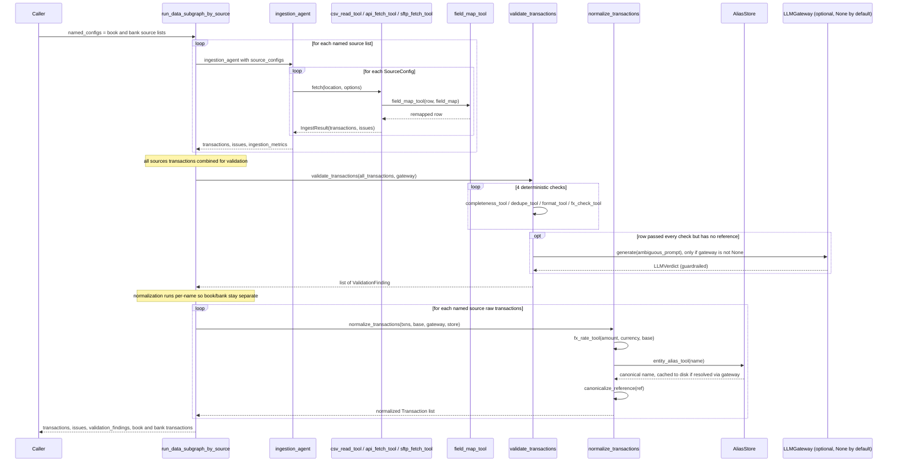
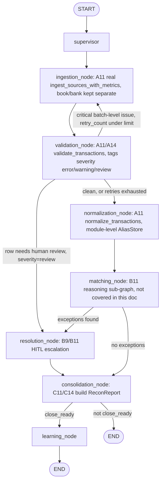

# Data Sub-graph Sequence Diagram

Two views, both traced against the real code (data_subgraph.py and
recon_platform/graph/build.py), not written from memory.

## 1. Standalone call sequence (run_data_subgraph_by_source)

This is the actual function-call sequence when running the data agents on
their own, with no LangGraph involved.

## 2. Wired into the full compiled graph

Same three stages, but as LangGraph nodes composed with everyone elses
nodes (recon_platform/graph/build.py). This is what actually runs via
build_graph().invoke(...) in the demo/production path, including the
validation-failure retry loop and the escalation branch to human review.

A rendered PNG of this same full graph already exists at
docs/graph/recon_graph.png (generated by scripts_render_graph.py) -- this
docs flowchart above is a hand-maintained, more detailed version scoped to
explain the data sub-graphs gates specifically.
